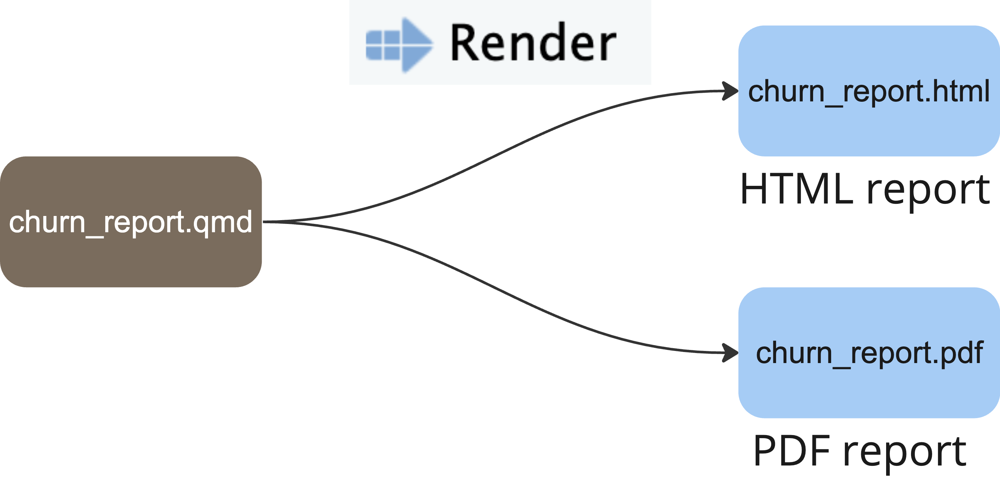

# DemoCo Customer Churn Quarto Report

This project contains an example report that summarizes customer churn for DemoCo, an example company. The main report, `01_report.qmd` is published to Connect and can be viewed [here](https://colorado.posit.co/rsc/demoCo-churn/).

The repository also contains:

-   `02_body.qmd`: This Quarto document contains the body of the report. `01_report.qmd` renders `02_body.qmd` as a child document.
-   `03_pdf.qmd`: A PDF version of the report, which also renders `02_body.qmd` as a child document. This PDF reports uses a custom [Quarto extension](https://github.com/rstudio/demo-co-quarto-report/tree/main/_extensions/demopdf) to render a styled PDF.

## Build the reports

This files in this project create two different reports: an HTML report called `01_report.html` and a PDF report called `03_pdf.pdf`. Follow these steps to render the reports:

1.  **Render the HTML report:** Open `01_report.qmd` and click *Render*.
2.  **Render the PDF report:** Open `03_pdf.qmd` and click *Render*.

{width="500"}

### Publish to Posit Connect

We've published the HTML report to [Connect](https://colorado.posit.co/rsc/demoCo-churn/). The report is set to run once a week. You can publish the report to your own Connect account using the *Publish* button ({width="20"}) in the RStudio IDE, found in the upper-right corner of the Editor pane. Click {width="20"} \> *Posit Connect* \> *Publish document with source code* \> Add the URL of your Connect server \> *Publish*.

See this [guide](https://quarto.org/docs/publishing/rstudio-connect.html) for publishing Quarto documents for more details.

## Use as a template

You can also use this project as a template for your own reports.

Here are some ways to modify the HTML report:

-   Swap out the logo located in `images/logo.png` for your own logo.
-   Change the color scheme by changing the [color_palette object](https://github.com/rstudio/demo-co-quarto-report/blob/587c5eb6c543aaf9e7702ec3f0ab6ce2fb77476e/02_body.qmd#L11), defined in `02_body.qmd`.
-   Read in different data in `02_body.qmd`, and create your own plots.

To modify the look of the PDF report, edit the Quarto extension located in `_extensions/demopdf`:

-   Again, swap out the logo `logo.png` for your own logo.
-   Update the [extension color scheme](https://github.com/rstudio/demo-co-quarto-report/blob/587c5eb6c543aaf9e7702ec3f0ab6ce2fb77476e/_extensions/demopdf/demopdf.tex#L15), found in `demopdf.tex`. `light` defines the side panel color and `dark` defines the title and heading font color.
